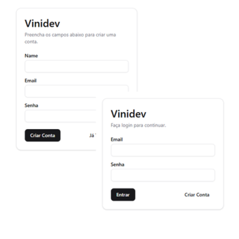

# Aplicação com cadastro, login e validação da sessão do usuário

## 🛠 Tecnologias

- ReactJS
- Tailwind CSS
- TypeScript
- Banco de Dados PostreSQL
- Prisma
- Shadcn/ui para fazer o formulário
- JWT Tokens com JOSE (https://www.npmjs.com/package/jose)
- Form Actions do Next.js

## 💛 Contato

vinibrunheroto12@gmail.com
